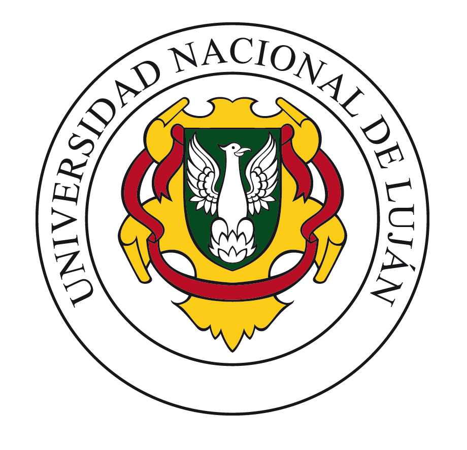
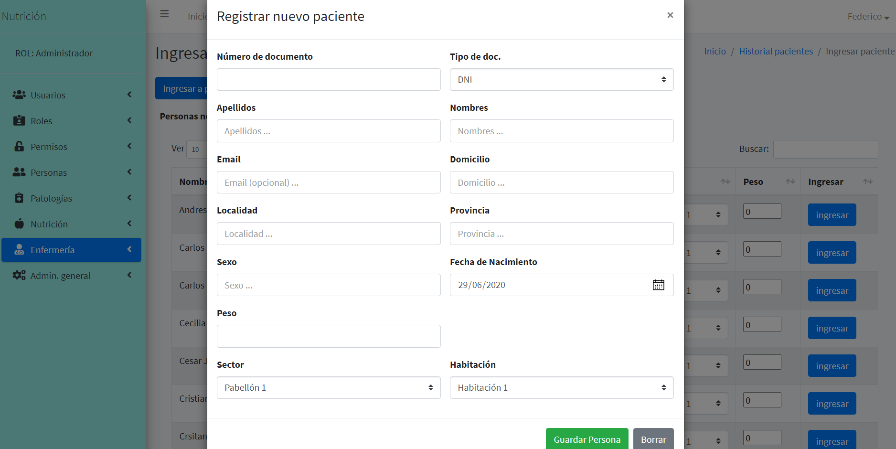
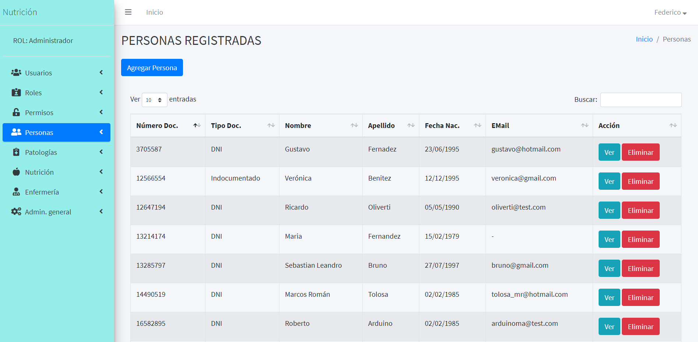
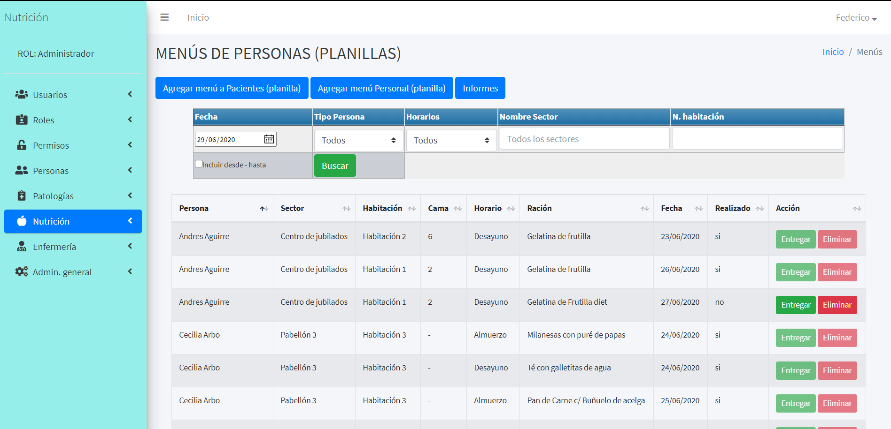
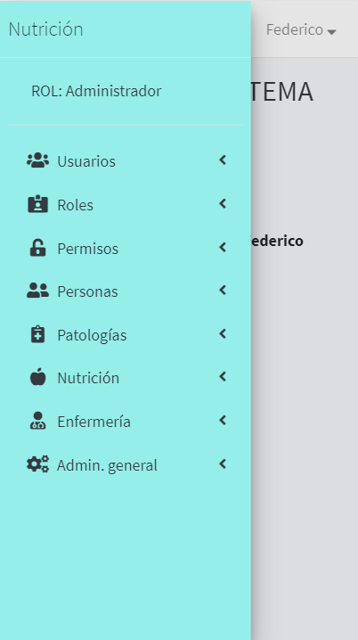
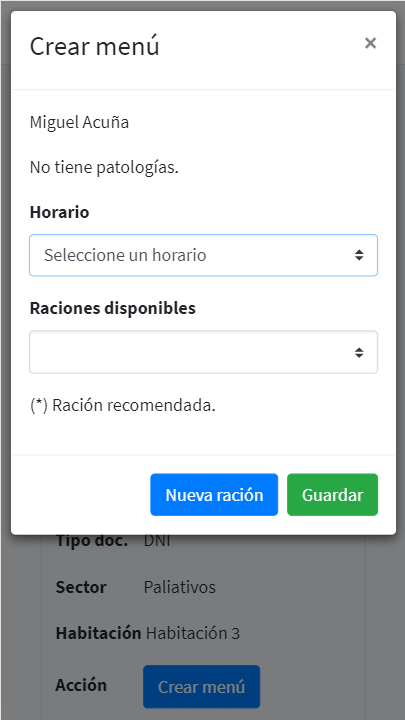

 
  <h1 align="center">Seminario de Integración Profesional (11087)</h1>
  <h2 align="center">Trabajo Práctico de Campo</h2>   

## Índice
* [Docentes](#docentes)
* [Integranes del grupo](#integrantes-del-grupo)
* [Acerca del proyecto](#acerca-del-proyecto)
    * [Objetivos alcanzados](#objetivos-alcanzados)
* [Herramientas utilizadas para el desarrollo](#herramientas-utilizadas-para-el-desarrollo)
* [Demo](#demo)
* [Guía de instalación](#guía-de-instalación)
* [Manual de usuario](#manual-de-usuario)
* [Screenshots](#screenshots)
    * [Desktop](#desktop)
    * [Mobile](#mobile)
    
* [Documentación](#documentación)
* [Licencia](#licencia)

## Docentes
Mg. Bibiana Rossi  
Lic. Viviana Chapetto  
Lic. David Petrocelli  

## Integrantes del grupo
| Alumno | N°. Legajo |
| ------ | ------ |
|Larena Estaban Nicolás|154582|
|Ledesma Arnaldo Federico|156020|
|Cravero Cristian|81171|

## Acerca del proyecto

El proyecto fue desarrollado para el sector de nutrición del Hospital Nacional "Dr. Baldomero Sommer" ubicado en la localidad de General Rodríguez, Buenos Aires, Argentina.

### Objetivos alcanzados

 - Automatizar la integración de los datos recolectados por los nutricionistas a la hora de asignar el menú que va a recibir una persona durante el día.
 - Generar informes dirigidos hacia el personal que se encarga de preparar las raciones (personal de cocina), los cuales se harán de forma digital con la posibilidad de ser impresos.
 - Generar un informe anual con los insumos que se utilizaron a lo largo del año, con el objetivo de servir como guía para una compra (licitación) de alimentos. Dichos informes podrán ser anuales y mensuales.
 -	Además, el sistema ofrece una funcionalidad mínima para el alta y baja de pacientes o personal, con el fin de realizar el seguimiento de la alimentación recibida por los mismos.
-	Ofrecer al profesional de turno una recomendación de qué menú asignar a las personas que se encuentran en el hospital, según la disponibilidad de las raciones y lo que han consumido a lo largo de un periodo, también brinda información del historial nutricional de los pacientes.
-	El sistema lleva un control de stock diario de las raciones en sus respectivos horarios, registrando los movimientos que se hacen sobre las mismas.

## Herramientas utilizadas para el desarrollo
 

</img>
</img>
</img>
</img>
</img>
</img>

## Demo
* http://agile-retreat-65340.herokuapp.com/
* Credenciales
    * Número de documento: **40000000**
    * Contraseña: **12345678**

## Guía de instalación

- Clonar el repositorio utilizando `git clone https://github.com/FedericoLedesma/Seminario-Integracion-Profesional.git`
- Instalar las dependencias ejecutando `composer install`
- Crear una base de datos con codificación `utf8mb4_general_ci` 
- Renombrar el archivo de configuración con el comando `copy .env.example .env` 
- Migrar la base de datos con `php artisan migrate` 
- Correr el seeder **DatabaseSeeder.php** con el comando `php artisan db:seed--class=DatabaseSeeder`
- Levantar el servidor u `php artisan serve`

## Manual de usuario
* [Manual de usuario e instalación](Documentacion/Manual_de_usuario_alimentación.pdf)

## Screenshots
### Desktop
</img>
</img>
</img> 
### Mobile
</img>
</img>
</img> 
*Los datos mostrados no son reales, tienen fines ilustrativos.*

## Documentación
* [Especificación General de Requerimientos](Documentacion/EGR_Grupo1_Sommer.pdf)
* [Manual de usuario e instalación](Documentacion/Manual_de_usuario_alimentación.pdf)
* [Carta de cumplimiento de PPS](Documentacion/Carta_de_cumplimiento_de_PPS.pdf)
* [Proyecto de Enterprise Architect](https://github.com/FedericoLedesma/Seminario-Integracion-Profesional/blob/master/Documentacion/Sistema_Alimentacion_EA.eap)

## Licencia

The Laravel framework is open-source software licensed under the [MIT license](https://opensource.org/licenses/MIT).
